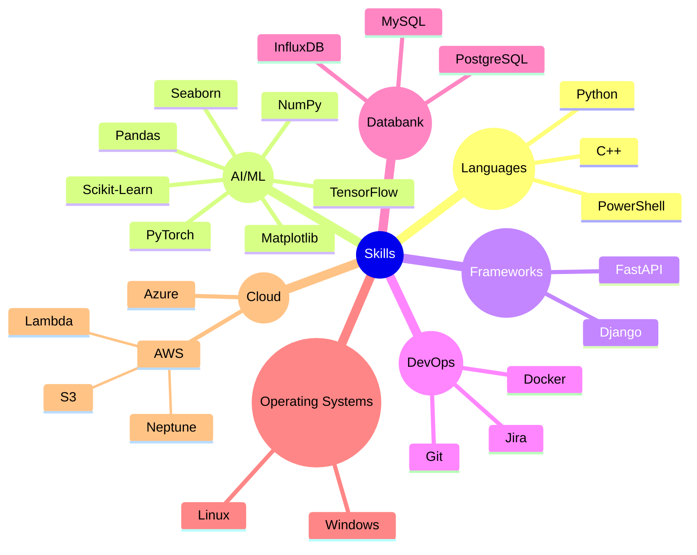

<h1 align="center">Hi, I'm Arshan Abbas 🤖</h1>
<h3 align="center">AI & IoT Innovator | Backend Developer | Data-Driven Technologist</h3>

---

  

---

### 🔍 About Me

- 🎓 Master's in Computer Science (Embedded Systems) from University of Siegen, Germany
- 🌟 Specializing in AI-based welding defect detection using Deep Learning & OpenCV
- 📅 3+ years of industry experience in automation, IoT, and backend systems
- 🚀 Focused on building **real-world data systems** that serve real users
- 🌐 Multilingual: Fluent in English, B2-level German (C1 in progress), Hindi native

---

### 📈 Tech Snapshot

---

### 📊 GitHub Analytics

  
  

---

### 💼 Featured Projects

- 🧪 **AI Welding Error Detector**  
  Deep learning + image segmentation + OpenCV in industrial setting. 

- 🌿 **Smart Agriculture IoT System**  
  Real-time sensor data + LSTM forecasting + InfluxDB + Grafana.

- 📖 **Learning Management Platform**  
  Developed Moodle-based tools and optimized data integrations across universities.

---

### 🌟 Recognition

- 💼 Letter of Recommendation from Dr.-Ing. Fabian Muhs (TIME GmbH)
- 🌟 ATHENA European University: Public Relations & Hackathon Organizer
- 🌟 IBM Certified: Prompt Engineering for Generative AI

---

### 📞 Let's Connect

  
  
  

---

<blockquote align="center">"Translating data into decisions, and code into real-world change."</blockquote>

